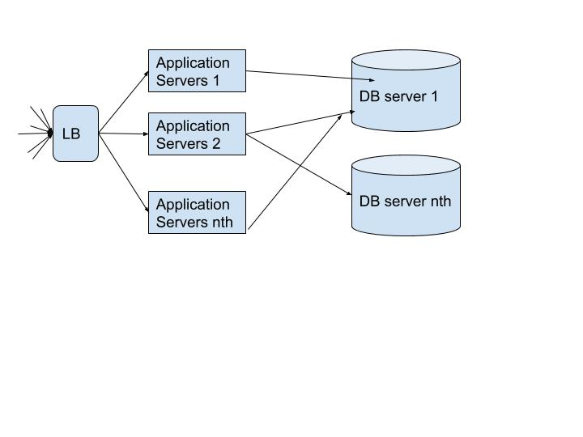
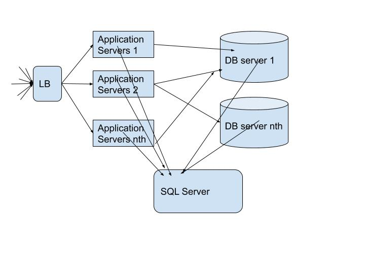
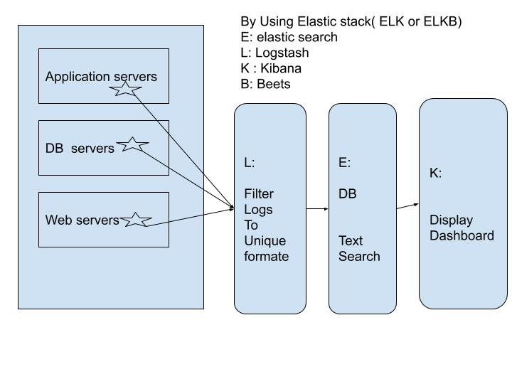

# Application Monitoring :

---

### For Example:
 * we have application  called appworks.  For this application we have to provide a application monitoring solutions.
 

  * For this application, what is monitoring solution.
       * we can use sql
          * if we using  sql, we can't text search, Bucz of the date in structure.
          * what possibles log formated.
             > 2019-10-05 : 09:20:30:000 Error: class not fount Exp.

             > 09:20:30:00 : 2019-10-05 Error: sql update fail
            
              
### for solutions
  * Elastic stack
      * logs
      * trace
      * basic system.

    

### Elastic search
   *  it's a data base
   *  it's doesn't have schema
   *  it's best for text search

 [Refer](https://www.elastic.co/guide/en/elasticsearch/reference/current/getting-started.html)

### logstash:
    * it can filter logs and output will unique formate of logs
    * it's output will be sent to Elastic search.

[Refer](https://www.elastic.co/guide/en/logstash/current/getting-started-with-logstash.html)

### kibana:
    * it's a dashboard to display  logs in  graphs.
[Refer](https://www.elastic.co/guide/en/kibana/current/getting-started.html)

### beats:
    * beats install on each node of pord,
    * then these beats will send logs to logstash or elastic search.
     
      * file beats
      * packet beats
      * metric beats
      * winlog beats....etc

[Refer](https://www.elastic.co/guide/en/beats/libbeat/current/getting-started.html)
       

            
