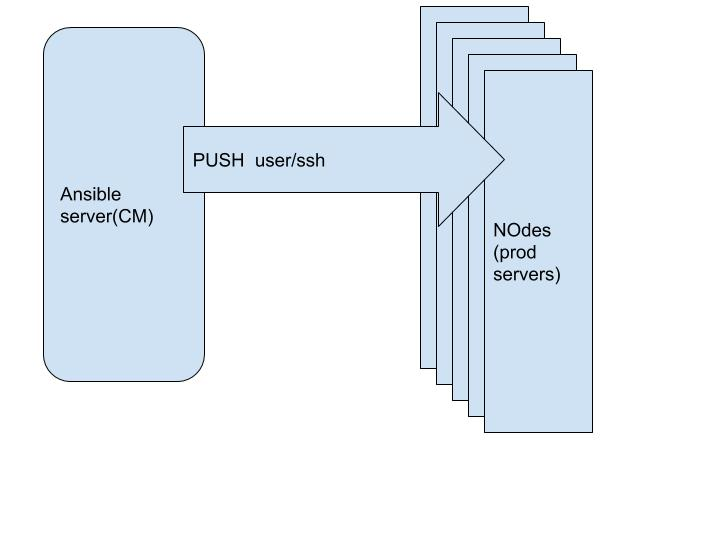

# Install & config ansible setup



## On Master:  Stage1 : install and config ansible 

```
1) install ansible on ubuntu 16.04 
  # apt-get update
  # apt-add-repository ppa:ansible/ansible
  # apt-get update
  # apt-get install ansible
  # ansible --version

2) create user (maha)
  # adduser maha

3) we make maha user as a sudo user
  #  visudo
     maha ALL=(ALL) NOPASSWD: ALL
     :wq!

4) we have to connect to nodes  with out pem file.
  # vi /etc/ssh/sshd_config
    PasswordAuthentication yes
   :wq!
  # service ssh restart


```
[install ansible link](https://www.digitalocean.com/community/tutorials/how-to-install-and-configure-ansible-on-ubuntu-16-04)

## On Nodes : stage2 : config ansible node 
```

1) Don't install ansible on any nodes
  
2) create user (maha)
  # apt-get update
  # adduser maha

3) we make maha user as a sudo user
  #  visudo
     maha ALL=(ALL) NOPASSWD: ALL
     :wq!

4) we have to connect to nodes  with out pem file.
  # vi /etc/ssh/sshd_config
    PasswordAuthentication yes
   :wq!
  # service ssh restart

```
## On Master : stage3 : make communication  ansible master to nodes

```
1) with passwd we can able to logging into node  by using  ansible user (maha)
   $ ssh <private ip of any node>

2) with out, we should logging into into any node
   $ ssh-keygen

3) copy key id into ansible nodes
   $ ssh-copy-id <private ip of node>


4) let's  check ansible point.
  $ mkdir myansilefolder
  $ cd myansiblefolder
  $ vi myhosts
    172.31.90.85
    <private ips of all nodes line by line>
    :wq!
  $ ansible all -i myhosts -m ping

5) let's write playbook and execute.
   $ vi myping.yml
    ---
    - hosts: all
      become: yes
      tasks:
      - name: i am going to ping all my nodes
        ping:
      - name: instal webserver
        apt:
         name: apache2
     :wq!
     $ ansible-playbook -i myhosts myping.yml
     


```